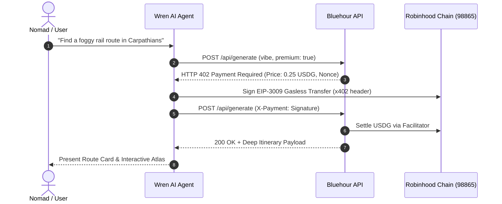

# 🌌 Bluehour

> **"Where do you want to disappear?"**  
> The AI travel companion & mystery route protocol for web3 nomads. Powered by **Robinhood Chain** & **x402 Micropayments**.

---

-CCFF00?style=for-the-badge&logoColor=15150F)


---

## 🦅 Overview

**Bluehour** is a decentralized travel discovery platform and AI companion built for digital nomads, wanderers, and off-grid explorers. 

Instead of traditional travel booking engines or generic blog posts, Bluehour focuses on **unmapped mystery routes** — quiet trails, rainy night cafes, mountain cabins, and hidden coastal towns that tourists never see.

### Core Features

- 🦅 **Wren — AI Migratory Companion**: Tell Wren a mood (*"foggy alpine rail, under €700, 7 days"*), and it plots a complete, unmapped route with coordinates, day-by-day stops, and budget breakdowns.
- ⚡ **x402 AI Micropayment Protocol**: Wren pays for deep compute using HTTP 402 gasless USDG micropayments via EIP-3009 signatures on Robinhood Chain — zero wallet popups, zero friction.
- 🗺️ **Mystery Route Atlas**: Publish secret trails only you know. Other wanderers can discover, save, and walk your exact trail.
- 📸 **EXIF Photo Proof Verification**: Payouts require physical presence. Travelers upload photos at each stop; GPS coordinates and EXIF metadata are verified onchain to prevent sybil farming.
- 💰 **Creator Royalties & Onchain Settlements**: Every time a traveler completes your route, an automatic creator royalty is disbursed directly to your embedded wallet in USDC on Robinhood Chain.

---

## 🌐 Built on Robinhood Chain

Bluehour is natively deployed on **Robinhood Chain** (EVM Layer 2) to leverage ultra-low latency, sub-penny gas fees, and gas-sponsored relayers for seamless agentic AI transactions.

| Specification | Value |
| --- | --- |
| **Network Name** | Robinhood Chain |
| **Chain ID** | `98865` |
| **Native Asset** | ETH / USDG |
| **Settlement Standard** | USDC / EIP-3009 Gasless |
| **Merchant Wallet** | `0x5b78709bF844d5aD0d46f40b2D7f32394F70C246` |

---

## 🔄 x402 Micropayment Architecture



---

## 🛠️ Tech Stack

- **Frontend**: Next.js 16 (App Router, Turbopack), React 19, Tailwind CSS v4
- **Authentication & Wallets**: Privy SDK (Embedded Wallets, Email/Social Auth)
- **Database & Storage**: Supabase (PostgreSQL, Row Level Security)
- **Blockchain**: Robinhood Chain L2, EIP-3009 Gasless USDG Permits
- **AI Agent Engine**: Google Gemini API / x402 Facilitator integration
- **Icons & UI**: Lucide React, Google Inter typography

---

## 🚀 Getting Started

### Prerequisites

- Node.js 18+ 
- npm or yarn

### Environment Setup

Create a `.env.local` file in the root directory:

```env
# Privy Auth
NEXT_PUBLIC_PRIVY_APP_ID=cms65uenz02km0dl1kmgda3pe
PRIVY_APP_SECRET=privy_app_secret_...

# Supabase Storage & DB
NEXT_PUBLIC_SUPABASE_URL=https://fqzexapkdjcpfcoacvqf.supabase.co
NEXT_PUBLIC_SUPABASE_ANON_KEY=eyJhbGciOiJIUzI1NiIsInR5cCI6IkpXVCJ9...
SUPABASE_SERVICE_ROLE_KEY=eyJhbGciOiJIUzI1NiIsInR5cCI6IkpXVCJ9...

# Robinhood Chain x402 Protocol
X402_MERCHANT_ADDRESS=0x5b78709bF844d5aD0d46f40b2D7f32394F70C246
NEXT_PUBLIC_ROBINHOOD_CHAIN_ID=98865
```

### Installation

```bash
# Clone the repository
git clone https://github.com/sshinobii/Blue-Hour.git
cd Blue-Hour

# Install dependencies
npm install

# Run development server
npm run dev
```

Open [http://localhost:3000](http://localhost:3000) to view the app in your browser.

---

## 📜 License

MIT License © 2026 Bluehour Protocol. Built for web3 wanderers on Robinhood Chain.
